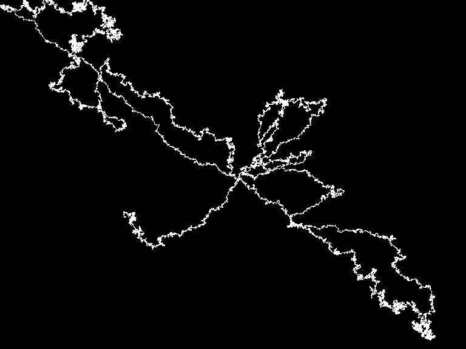

# Intro - Exercise I.3

> Create a random walker with dynamic probabilities. For example, can you give it a 50% chance of moving in the direction of the mouse?

[Link](http://natureofcode.com/book/introduction/#intro_exercise3)

