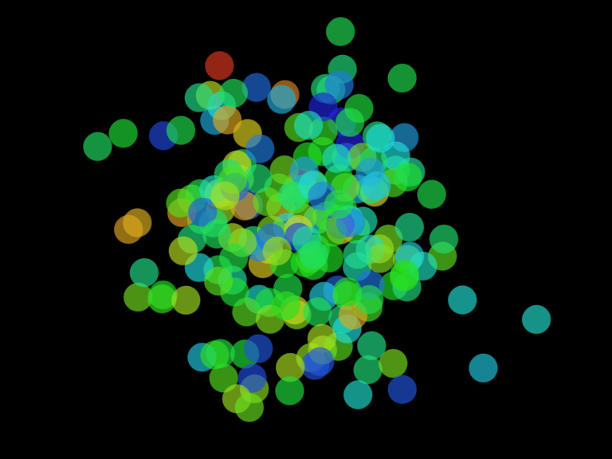

# Intro - Exercise I.4

> Consider a simulation of paint splatter drawn as a collection of colored dots. Most of the paint clusters around a central location, but some dots do splatter out towards the edges. Can you use a normal distribution of random numbers to generate the locations of the dots? Can you also use a normal distribution of random numbers to generate a color palette?

[Link](http://natureofcode.com/book/introduction/#intro_exercise4)

