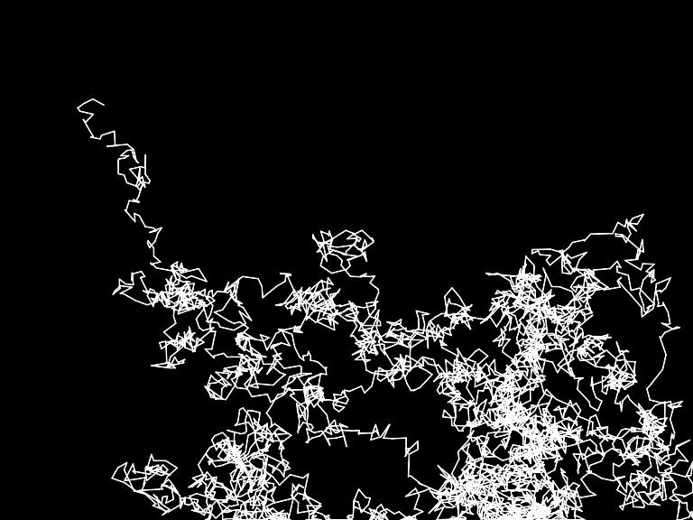

# Intro - Exercise I.5

> A Gaussian random walk is defined as one in which the step size (how far the object moves in a given direction) is generated with a normal distribution. Implement this variation of our random walk.

[Link](http://natureofcode.com/book/introduction/#intro_exercise5)

