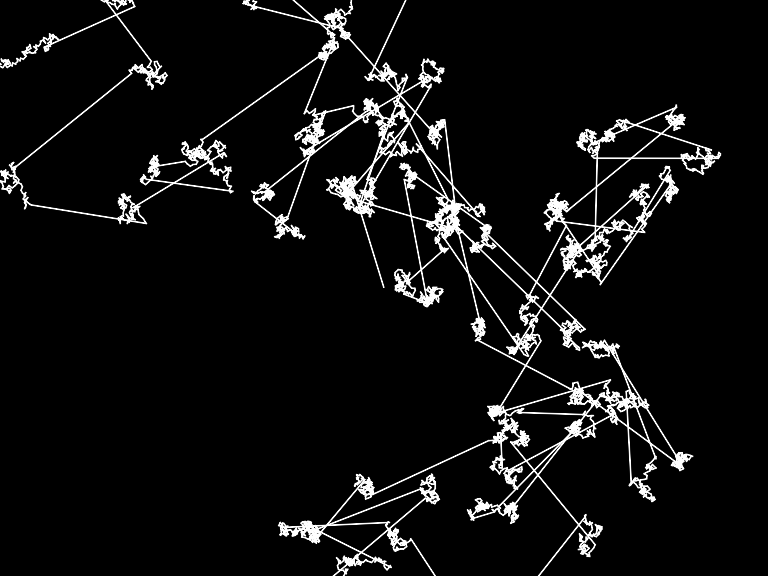

# Intro - Exercise I.6

> Use a custom probability distribution to vary the size of a step taken by the random walker. The step size can be determined by influencing the range of values picked. Can you map the probability exponentially—i.e. making the likelihood that a value is picked equal to the value squared?

	float stepsize = random(0,10); // A uniform distribution of step sizes. Change this!
	
	float stepx = random(-stepsize,stepsize);
	float stepy = random(-stepsize,stepsize);
	
	x += stepx;
	y += stepy;

[Link](http://natureofcode.com/book/introduction/#intro_exercise6)

