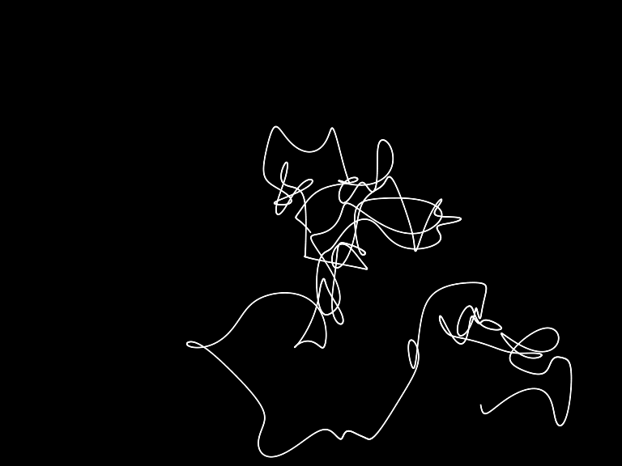

# Intro - Exercise I.7

> In the above random walker, the result of the noise function is mapped directly to the Walker’s location. Create a random walker where you instead map the result of the noise() function to a Walker’s step size.

[Link](http://natureofcode.com/book/introduction/#intro_exercise7)

