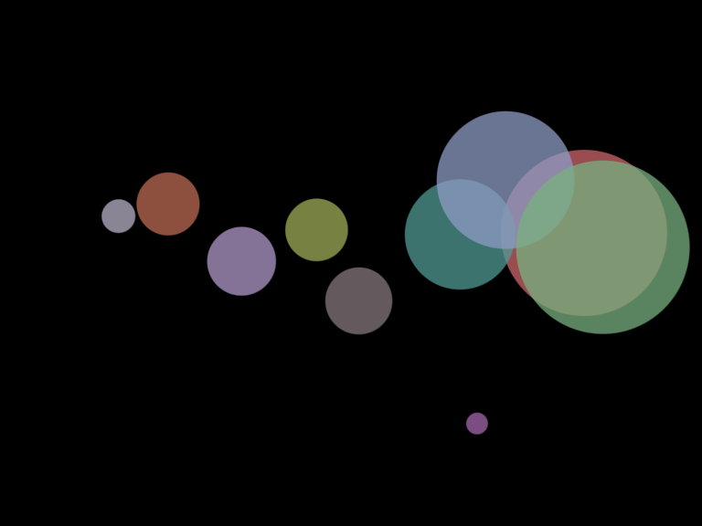

# Forces - Exercise 2.3

> Instead of objects bouncing off the edge of the wall, create an example in which an invisible force pushes back on the objects to keep them in the window. Can you weight the force according to how far the object is from an edge—i.e., the closer it is, the stronger the force?

[Link](http://natureofcode.com/book/chapter-2-forces/#chapter02_exercise3)

