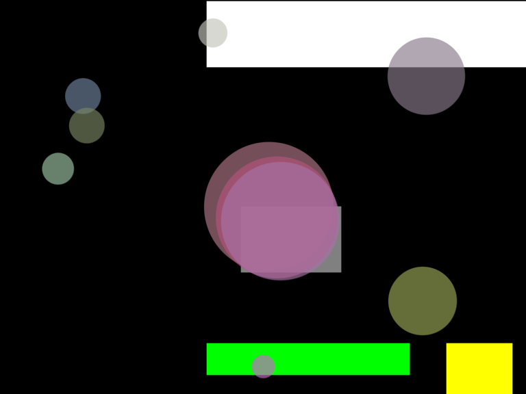

# Forces - Exercise 2.4

> Create pockets of friction in a Processing sketch so that objects only 
> experience friction when crossing over those pockets. What if you vary 
> the strength (friction coefficient) of each area? What if you make some 
> pockets feature the opposite of friction—i.e., when you enter a given 
> pocket you actually speed up instead of slowing down?

[Link](http://natureofcode.com/book/chapter-2-forces/#chapter02_exercise4)

